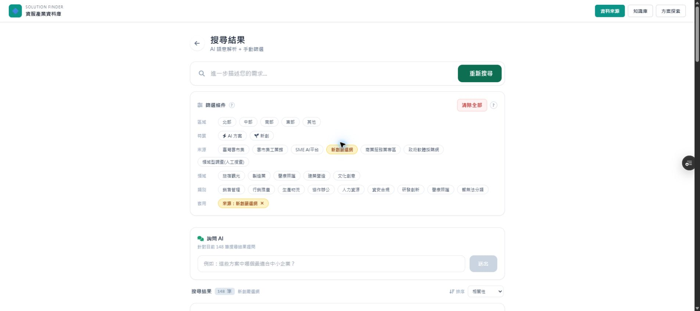
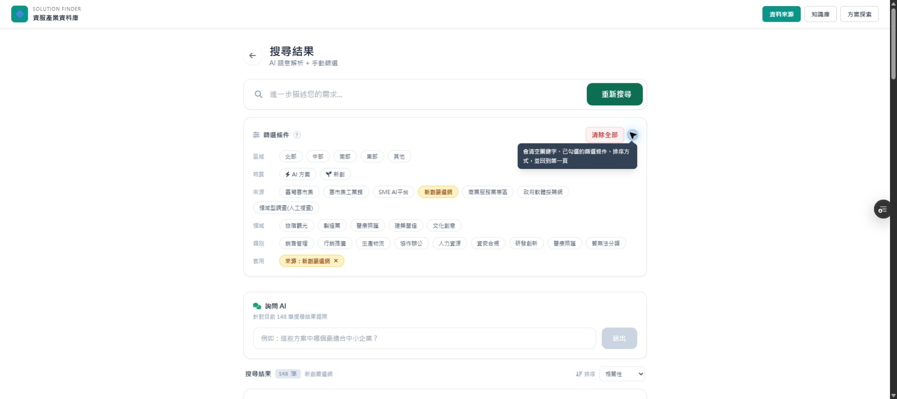
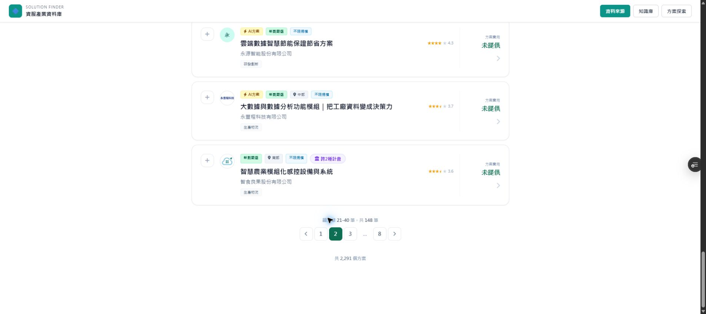
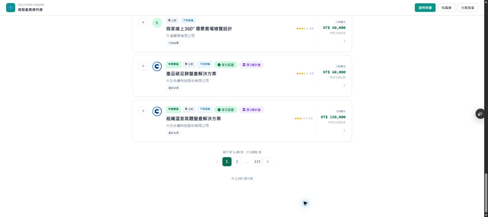

# SYNC: 清除全部按鈕、頁碼重置與 Hover 說明

日期：2026-09-22

## Git 資訊

- Branch: `fix/clear-all-reset-tooltip-2026-09-22`
- 功能 commit: `956d3a7855cdb966ef68d9581c8f4df9de4dfdab`
- PR: https://github.com/Pcc329/solution-finder/pull/167
- Preview: https://solution-finder-git-fix-clear-a7debe-patrick0814-6136s-projects.vercel.app/

## 實際改動

程式碼只修改 `public/index.html`。

### clearAll 前後對照

改前：

```js
const clearAll = () => {
  setFilters({ region: [], isAI: null, isStartup: null, isGov: null, pricingModel: null, category: [], maxPrice: null, keyword: null, program: [], industry_vertical: [], industryKeyword: null });
  setQuery("");
  setSortBy("relevance");
};
```

改後：

```js
const clearAll = () => {
  setFilters({ region: [], isAI: null, isStartup: null, isGov: null, pricingModel: null, category: [], maxPrice: null, keyword: null, program: [], industry_vertical: [], industryKeyword: null });
  setQuery("");
  setSortBy("relevance");
  setCurrentPage(1);
};
```

### 按鈕與 Hover 說明

既有 `clearAll` 按鈕仍受 `hasActiveFilters` 控制，改為淡紅實心按鈕；右側新增無狀態的 CSS group-hover tooltip。說明文字為：

> 會清空關鍵字、已勾選的篩選條件、排序方式，並回到第一頁

沒有新增 React state、第二個清空函式或第二個清除按鈕；既有 `showFilterTip` 未修改。

## Preview 驗證

驗證環境：PR #167 Vercel Preview，實際 API 載入 2,291 筆方案。

1. 套用「新創嚴選網」後有 148 筆結果，放大的「清除全部」按鈕與說明圖示正常顯示。
2. 游標停留／聚焦「?」後，深色說明框立即顯示；移開／失焦後隱藏。
3. 翻到第 2 頁時顯示「第 21 - 40 筆，共 148 筆」。
4. 按下「清除全部」後，所有條件清除、控制組隱藏，結果回到 2,291 筆，頁碼回到第 1 頁並顯示「第 1 - 20 筆」。
5. 首頁、方案詳情、主題區導覽未修改；`manufacturing.html`、`api/`、資料庫未修改。

## 驗收截圖

### 放大後按鈕



### Hover 說明



### 清除前：第 2 頁



### 清除後：回到第 1 頁



## 驗收結果

- [x] 第 2 頁或更後頁點擊清除全部會回到第 1 頁
- [x] 清除全部按鈕比原文字連結明顯
- [x] Hover 顯示說明，移開後消失
- [x] 無篩選時整組按鈕與說明圖示不顯示
- [x] 沿用既有 `clearAll`，未建立第二套清空邏輯
- [x] `showFilterTip`、popstate、compareItems、compareNotice 均未修改
