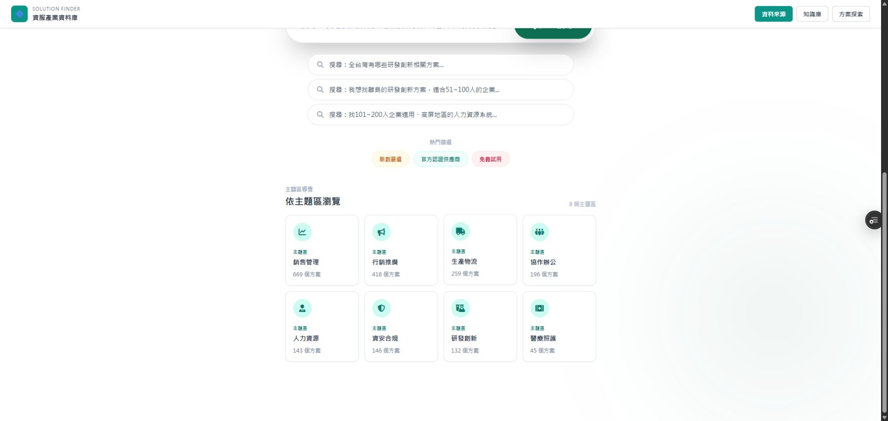
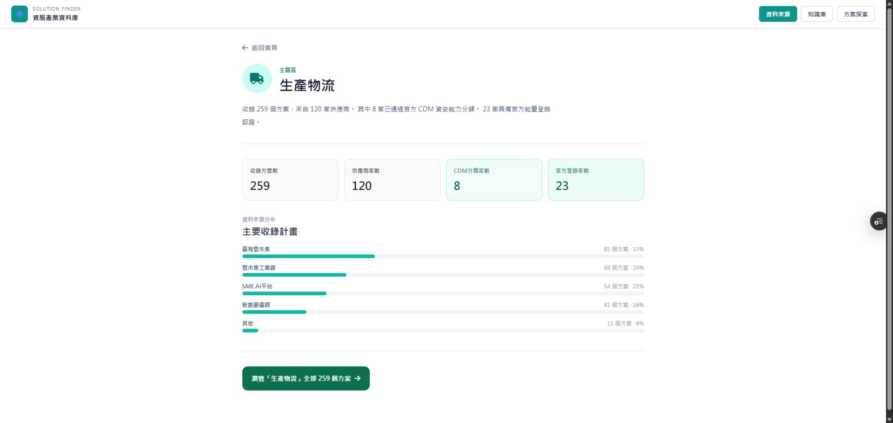
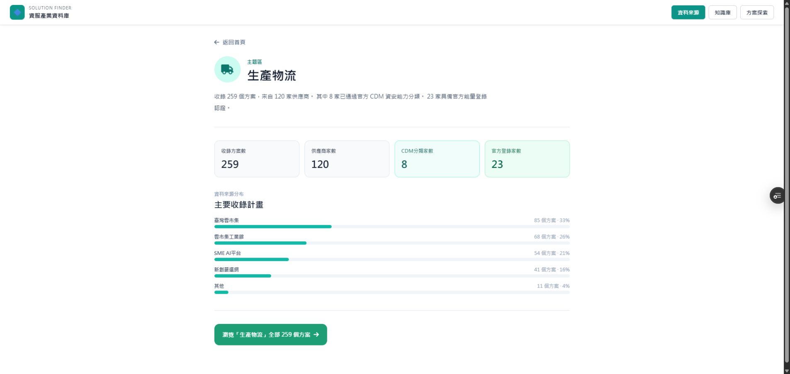
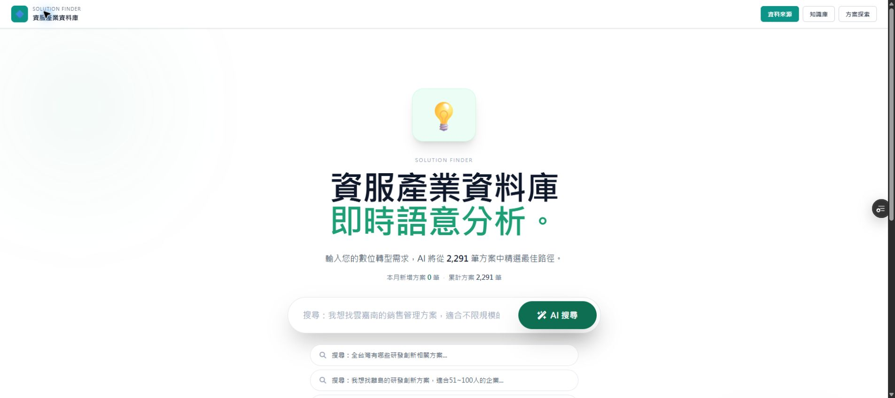

# SYNC: 主題詳情返回首頁與全站 Logo 直接回首頁

日期：2026-09-22

## 改動範圍

程式碼只修改 `public/index.html`。

### 新增 resetToHome

```js
const resetToHome = () => {
  setQuery("");
  setFilters({ region: [], isAI: null, isStartup: null, isGov: null, pricingModel: null, category: [], maxPrice: null, keyword: null, program: [], industry_vertical: [], industryKeyword: null });
  setSortBy("relevance");
  setCurrentPage(1);
  setSelectedItem(null);
  setSelectedCategory(null);
  setActivePage("home");
};
```

### 指定的兩處 onClick

改前：

```jsx
<button onClick={goBackInApp}>...返回首頁</button>
<div className="global-nav-brand" onClick={goBackInApp}>
```

改後：

```jsx
<button onClick={resetToHome}>...返回首頁</button>
<div className="global-nav-brand" onClick={resetToHome}>
```

方案詳情頁仍保留 `onClick={goBackInApp}`；`goBackInApp` 函式未刪除。

## Preview 驗證

- Preview: https://solution-finder-git-fix-direc-beafbb-patrick0814-6136s-projects.vercel.app/
- 實際 API 載入：2,291 筆方案
- 路徑一：首頁 → 生產物流主題詳情 → 點「返回首頁」；一次點擊即顯示完整首頁。
- 路徑二：首頁 → 生產物流主題詳情 →「瀏覽全部 259 個方案」→ 搜尋結果；點全站 Logo，一次點擊即顯示完整首頁。
- `resetToHome` 沒有呼叫 `setCompareItems` 或 `setCompareNotice`，比較狀態不會被清除。
- 搜尋結果返回、方案詳情返回、`popstate`、`pushHistoryView` 均未修改。
- `manufacturing.html` 未修改。

## 驗收截圖

### 1. 主題詳情頁



### 2. 點「返回首頁」後



### 3. 主題 CTA 後的第二層搜尋結果



### 4. 第二層點 Logo 後



## Git 資訊

- Branch: `fix/direct-home-navigation-2026-09-22`
- 功能 commit: `869c598025746994a4c5d26a257e8397dc1f4b97`
- PR: https://github.com/Pcc329/solution-finder/pull/169

## 驗收結果

- [x] 主題詳情「返回首頁」一次點擊直接顯示首頁
- [x] 第二層搜尋結果點 Logo 一次直接顯示首頁
- [x] `compareItems`／`compareNotice` 不被清空
- [x] 方案詳情與搜尋結果既有返回行為未修改
- [x] `popstate`、`goBackInApp`、`pushHistoryView` 未修改
- [x] 未修改 `manufacturing.html`
