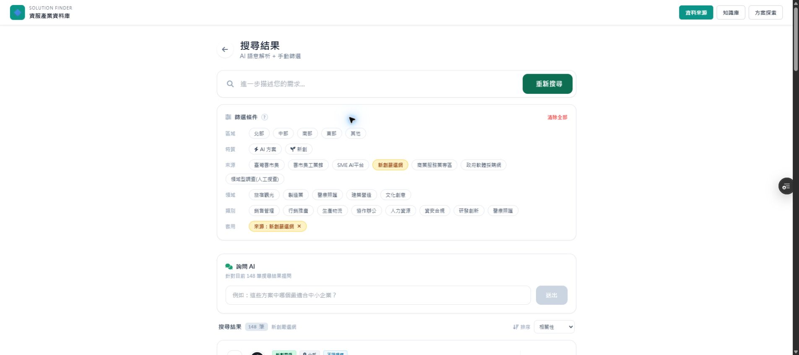

# SYNC: 篩選面板移除「暫無法分類」

日期：2026-09-22

## 改動範圍

程式碼只修改 `public/index.html` 的 `CATEGORIES` 陣列。

改前：

```js
const CATEGORIES = ["銷售管理", "行銷推廣", "生產物流", "協作辦公", "人力資源", "資安合規", "研發創新", "醫療照護", "暫無法分類"];
```

改後：

```js
const CATEGORIES = ["銷售管理", "行銷推廣", "生產物流", "協作辦公", "人力資源", "資安合規", "研發創新", "醫療照護"];
```

既有主題區的 `.filter(category => category !== "暫無法分類")` 保留不動；`CATEGORY_ICON` 未修改。

## Preview 驗證

- Preview: https://solution-finder-git-fix-hide-6cbd8d-patrick0814-6136s-projects.vercel.app/
- 實際 API 載入：2,291 筆方案
- 搜尋結果頁「類別」只顯示 8 項：
  1. 銷售管理
  2. 行銷推廣
  3. 生產物流
  4. 協作辦公
  5. 人力資源
  6. 資安合規
  7. 研發創新
  8. 醫療照護
- 畫面未出現「暫無法分類」。
- 首頁主題區導覽仍顯示 8 個主題區。
- `CATEGORIES.forEach` 仍正常運作，僅少判斷已移除的內部分類。
- `manufacturing.html`、API、資料庫均未修改。

## 驗收截圖



## Git 資訊

- Branch: `fix/hide-uncategorized-filter-2026-09-22`
- 功能 commit: `b39de9c33d857a3554b25b03367ef185a63a8c19`
- PR: https://github.com/Pcc329/solution-finder/pull/168

## 驗收結果

- [x] 篩選面板不再出現「暫無法分類」
- [x] 主題區導覽維持 8 個主題區
- [x] 關鍵字類別判斷正常
- [x] 未修改 `manufacturing.html`
- [x] 未修改底層資料或 `CATEGORY_ICON`
