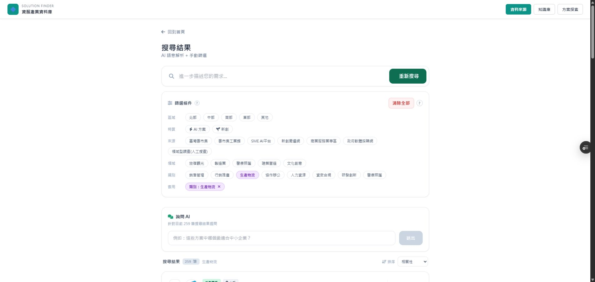

# SYNC: 搜尋結果頁「回到首頁」文字按鈕

日期：2026-09-23

## 改動範圍

程式碼只修改 `public/index.html` 的搜尋結果頁 Header JSX。

### 改前

```jsx
<div className="flex items-center gap-4 mb-6">
  <button onClick={() => setActivePage("home")} className="w-10 h-10 bg-white rounded-full shadow flex items-center justify-center text-slate-500 hover:text-emerald-600 transition-colors">
    <i className="fa-solid fa-arrow-left"></i>
  </button>
  <div>
    <h2 className="text-2xl font-bold text-slate-800">搜尋結果</h2>
    <p className="text-sm text-slate-500">AI 語意解析 + 手動篩選</p>
  </div>
</div>
```

### 改後

```jsx
<button onClick={() => setActivePage("home")} className="flex items-center gap-2 text-sm text-slate-500 hover:text-emerald-600 mb-6 transition-colors">
  <i className="fa-solid fa-arrow-left"></i> 回到首頁
</button>
<div className="mb-6">
  <h2 className="text-2xl font-bold text-slate-800">搜尋結果</h2>
  <p className="text-sm text-slate-500">AI 語意解析 + 手動篩選</p>
</div>
```

`onClick={() => setActivePage("home")}` 原樣保留，沒有改成 `resetToHome` 或其他函式。

## Preview 驗證

- Preview: https://solution-finder-git-fix-searc-b8043a-patrick0814-6136s-projects.vercel.app/
- 實際 API 載入：2,291 筆方案
- 操作路徑：首頁 → 生產物流主題詳情 →「瀏覽全部 259 個方案」→ 搜尋結果頁。
- 「← 回到首頁」獨立顯示於「搜尋結果」標題上方。
- 「搜尋結果」與「AI 語意解析 + 手動篩選」文字及樣式保持原樣。
- 點擊「回到首頁」一次即顯示完整首頁。
- 搜尋框、篩選面板、清除全部、AI 詢問及結果列表均正常顯示。
- 方案詳情返回按鈕、`manufacturing.html`、API 均未修改。

## 驗收截圖

### 兩層深搜尋結果頁



### 點擊後回到首頁


## Git 資訊

- Branch: `fix/search-results-home-label-2026-09-23`
- 功能 commit: `f7a482f604632873aa237a2a08737171addeeed6`
- PR: https://github.com/Pcc329/solution-finder/pull/170

## 驗收結果

- [x] 搜尋結果頁顯示獨立一行的「← 回到首頁」
- [x] 標題與副標另起一行且內容、樣式不變
- [x] 點擊一次直接顯示首頁
- [x] 從主題區 CTA 兩層深情境驗證通過
- [x] 其他搜尋結果功能未受影響
- [x] 未修改方案詳情返回按鈕或 `manufacturing.html`
