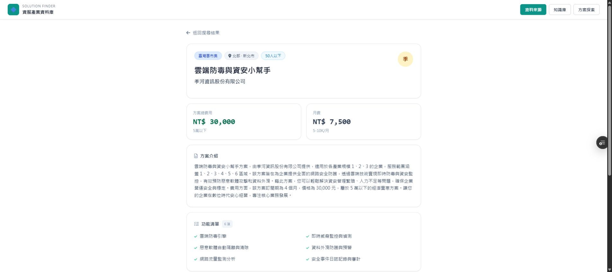
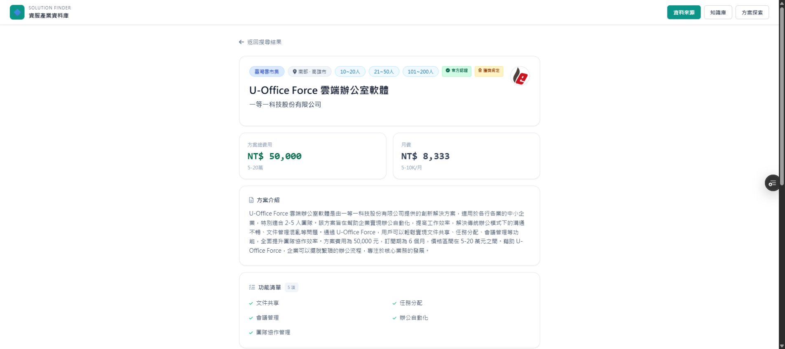

# SYNC target_scale 正規化與壓縮顯示
日期：2026-09-18

## Git
- Branch: `feat/target-scale-normalization-2026-09-18`
- Base main: `bb8c17801207b969bbb60979782f28e0139e4d36`
- Code commit: `fbcd10fb19fbfefa99897a7f0bd3587b39d4e851`
- PR: https://github.com/Pcc329/solution-finder/pull/164
- Preview: https://solution-finder-git-feat-targ-17d333-patrick0814-6136s-projects.vercel.app
- 本文件與截圖以後續文件 commit 追加；最終文件 commit SHA 可見 PR commits。未 merge。

## 改動
- public/target-scale.js：唯一共用 compressTargetScale，回傳 display、compressed、labels。
- public/index.html：列表、詳情標頭、方案屬性改用同一 helper；非連續規模分別顯示 badge。
- public/manufacturing.html：行內詳情與保留的 renderDetail 使用相同 helper。
- 移除舊「四個以上值直接顯示不限」邏輯。五個標準桶才顯示不限；四桶連續仍是範圍。
- 單桶不壓縮、非連續不合併、未知值（含100人以上）保留原意；缺值不顯示。
- 篩選、排序、scoreSolution、getRecommendations、officialPrograms、API 程式碼未修改；未改 DB schema。
- 兩頁新增共用 script 引用，既有 Babel script 屬性未修改。

## Supabase 實際執行紀錄
來源：project apdbvjruevjprslhhvlx / public.solutions，SQL Editor 真實查詢，不使用 CSV 或 mock。
先查 information_schema：solution_id 為 text、target_scale 為 text[]。
全表總筆數：修改前 2487、修改後 2487。
依序完成 dry run 18 筆、4 筆小批次、SELECT 確認、其餘14筆更新、SELECT/COUNT 事後查核。
資料變更已執行，不必等 PR merge；前端待 PR merge 上線。

### 分布（陣列元素出現筆數，非總方案數）
| 值 | 前 | 後 |
|---|---:|---:|
|10-50人|10|0|
|10~20人|876|886|
|21~50人|809|819|
|51-100人|3|0|
|51~100人|709|712|
|101-200人|5|0|
|101~200人|663|668|
|9人以下|875|875|
|不限規模|129|129|
|100人以上|1|1|

受影響 ID 與原值：
- 10-50人：SOL-0676、0681、0767、0871、0905、0964、1119、1209、1368、1374（每筆原陣列只有此值）。
- 51-100人：SOL-1041、1375、1380（每筆原陣列只有此值）。
- 101-200人：SOL-0230、1001、1024、1042、1157（每筆原陣列只有此值）。

保留值事後 SELECT：
- SOL-0004：["10~20人","21~50人","101~200人"] 未改
- SOL-0832：["10~20人","51~100人"] 未改
- SOL-MOE-0448：["100人以上"] 未改

### SQL（本次已執行的邏輯）
```sql
-- Dry run，先檢查所有受影響列與預計值
SELECT solution_id, target_scale AS before_value,
CASE WHEN '10-50人' = ANY(target_scale)
THEN array_remove(array_replace(array_replace(target_scale,
  '51-100人', '51~100人'), '101-200人', '101~200人'), '10-50人')
  || ARRAY['10~20人', '21~50人']
ELSE array_replace(array_replace(target_scale,
  '51-100人', '51~100人'), '101-200人', '101~200人')
END AS after_value
FROM public.solutions
WHERE target_scale && ARRAY['51-100人','101-200人','10-50人'];

-- 第一批 4 筆，回傳 count=4；另行 SELECT 確認已存入
WITH changed AS (
  UPDATE public.solutions SET target_scale = CASE WHEN '10-50人' = ANY(target_scale)
THEN array_remove(array_replace(array_replace(target_scale,
  '51-100人', '51~100人'), '101-200人', '101~200人'), '10-50人')
  || ARRAY['10~20人', '21~50人']
ELSE array_replace(array_replace(target_scale,
  '51-100人', '51~100人'), '101-200人', '101~200人')
END
  WHERE solution_id IN ('SOL-0230','SOL-0676','SOL-0681','SOL-1041')
    AND target_scale && ARRAY['51-100人','101-200人','10-50人']
  RETURNING solution_id,target_scale
) SELECT count(*) AS updated_count,json_agg(changed) AS rows FROM changed;

-- 第二批剩餘 14 筆，回傳 count=14
WITH changed AS (
  UPDATE public.solutions SET target_scale = CASE WHEN '10-50人' = ANY(target_scale)
THEN array_remove(array_replace(array_replace(target_scale,
  '51-100人', '51~100人'), '101-200人', '101~200人'), '10-50人')
  || ARRAY['10~20人', '21~50人']
ELSE array_replace(array_replace(target_scale,
  '51-100人', '51~100人'), '101-200人', '101~200人')
END
  WHERE target_scale && ARRAY['51-100人','101-200人','10-50人']
    AND solution_id NOT IN ('SOL-0004','SOL-0832')
  RETURNING solution_id,target_scale
) SELECT count(*) AS updated_count,json_agg(changed) AS rows FROM changed;

-- 事後驗證：2487 / 0
SELECT count(*) AS total,
  count(*) FILTER (WHERE target_scale && ARRAY['51-100人','101-200人','10-50人'])
    AS remaining_variants
FROM public.solutions;

SELECT value,count(*)
FROM public.solutions CROSS JOIN LATERAL unnest(target_scale) AS value
GROUP BY value ORDER BY value;

SELECT solution_id,target_scale FROM public.solutions
WHERE solution_id IN ('SOL-0004','SOL-0832','SOL-MOE-0448');
```

## 真實 Preview 登入後驗證
2026-09-18 由使用者登入 Preview，讀取線上 /api/solutions 實際資料，兩頁顯示已載入2291筆。
2487為全表；2291為既有 API 過濾後清單，未修改過濾邏輯。
以下不是注入 mock 或直接呼叫隱藏 UI 狀態：皆透過搜尋、點擊卡片、問答產生推薦。

|真實方案|原始規模|首頁列表及詳情實測|
|---|---|---|
|SOL-0676 MantaGO對話式商務平台|10~20人、21~50人|10~50人|
|SOL-0004 U-Office Force 雲端辦公室軟體|10~20人、21~50人、101~200人|三枚独立 badge，不合併|
|SOL-0002 Shopass數位共榮護照OMO電商會員系統|五個標準桶|不限規模|
|SOL-0181 Genie CPO|51~100人、101~200人|51~200人|
|SOL-0088 EZ Started Plus|10~20人|10~20人|
|季河資訊 雲端防毒與資安小幫手|9人以下、10~20人、21~50人|50人以下|

另在列表可見上靖電腦的雲端網路防毒與資安服務顯示20人以下。
manufacturing 真實問答：機械設備 → 10-50人 → 剛起步 → 資料整合 → 尚未確定。
產生5+5筆推薦，展開 GoodLinker企業雲端戰情室，在「適用規模」顯示不限規模。
舊 renderDetail 為停用入口，僅做程式碼一致性檢查，未宣稱經由 UI 執行該停用入口。
瀏覽器 error logs 查詢結果為空陣列。沒有為此修改 AI 流程。

### 驗收截圖
其餘五筆及 manufacturing 截圖已在本次對話輸出；下列兩張另保存進 repo。



## 靜態驗證
- 12組具體 helper 輸入/輸出測試通過（包括非連續、未知值、空值、重複與未排序、四桶不等同不限）。
- Node 32種標準桶組合保護性檢查通過。
- node --check target-scale.js：exit 0。
- manufacturing 全部非空 inline script 經 Node vm.Script 語法檢查通過（1個）。
- index 的 JSX 由真實 Preview Babel/React 正常執行，未假稱可直接 node --check HTML/JSX。
- GitHub PR diff 已逐檔核對，僅共用 helper 與規模顯示呼叫點，無 API/篩選/排序變更。
- 下載前後檔案作 git diff --no-index --check：無空白錯誤；命令 exit 1 代表兩檔存在 diff，僅 Windows LF/CRLF 警告，非宣稱本機 checkout 的 git diff --check exit 0。

## 驗收結論
- [x] 三種舊格式歸零，標準桶拆分/替換完成。
- [x] 總筆數不變，保留兩筆指定非連續案例及100人以上。
- [x] 共用 helper，無重複壓縮邏輯，僅展示轉換。
- [x] 連續桶正確壓縮、完整五桶不限、單桶保留、非連續分別 badge。
- [x] 至少五筆真實 Preview UI 案例通過；兩頁皆已實際驗證。
- [x] PR待人工review/merge，未自行合併。

## 實際程式 diff
### public/index.html
```diff
@@ -7,6 +7,7 @@
   <title>台灣資服業者方案資料庫</title>
   <script src="/auth-gate.js"></script>
   <script src="/company-avatar.js"></script>
+  <script src="/target-scale.js"></script>
   <script>
     window.onerror = function(message, source, lineno, colno, error) {
       document.body.innerHTML = '<div style="padding: 2rem; color: #dc2626; font-family: sans-serif; text-align: center;"><h2>發生錯誤</h2><p>' + message + '</p></div>';
@@ -471,14 +472,10 @@ <h3 className="font-black text-slate-800 text-lg">ROI 試算</h3>
       // helper: 安全轉小寫字串（防止陣列或非字串欄位）
       const safeStr = (v) => (typeof v === 'string' ? v : Array.isArray(v) ? v.join(',') : String(v || ''));
 
-      const formatScaleDisplay = (scaleValue) => {
-        const list = Array.isArray(scaleValue) ? scaleValue : (scaleValue ? [scaleValue] : []);
-        const cleaned = list.map(value => (typeof value === 'string' ? value : String(value || '')).trim()).filter(Boolean);
-        if (!cleaned.length) return '';
-        if (cleaned.includes('不限規模')) return '不限規模';
-        if (cleaned.length >= 4) return '不限規模';
-        return cleaned.join('、');
-      };
+      const renderScaleBadges = (value, className) =>
+        window.compressTargetScale(value).labels.map(label => (
+          <span key={label} className={className}>{label}</span>
+        ));
 
       const getTrustBadges = (item) => (
         <>
@@ -1455,7 +1452,7 @@ <h3 className="text-sm font-bold text-slate-700 flex items-center gap-2 flex-wra
                       {item.st && <span className="bg-emerald-100 text-emerald-800 border border-emerald-200 text-[10px] px-2 py-0.5 rounded font-bold">新創嚴選</span>}
                       {item.iv && <span className="bg-purple-100 text-purple-800 border border-purple-200 text-[10px] px-2 py-0.5 rounded font-bold">{item.iv}</span>}
                       {item.r && <span className="bg-slate-100 text-slate-600 border border-slate-200 text-[10px] px-2 py-0.5 rounded"><i className="fa-solid fa-location-dot mr-1"></i>{item.r}</span>}
-                      {formatScaleDisplay(item.scale) && <span className="bg-sky-50 text-sky-700 border border-sky-200 text-[10px] px-2 py-0.5 rounded">{formatScaleDisplay(item.scale)}</span>}
+                      {renderScaleBadges(item.scale, "bg-sky-50 text-sky-700 border border-sky-200 text-[10px] px-2 py-0.5 rounded")}
                       {getTrustBadges(item)}
                     </div>
                     <div className="flex items-start justify-between gap-3 mb-1">
@@ -1556,7 +1553,7 @@ <h2 className="text-lg font-bold text-slate-900 truncate">{item.s || "（未命
                     {item.iv && <span className="bg-purple-100 text-purple-800 border border-purple-200 text-xs px-3 py-1 rounded-full font-bold">{item.iv}</span>}
                     {item.p && <span className="bg-blue-100 text-blue-800 border border-blue-200 text-xs px-3 py-1 rounded-full">{item.p}</span>}
                     {item.r && <span className="bg-slate-100 text-slate-600 border border-slate-200 text-xs px-3 py-1 rounded-full"><i className="fa-solid fa-location-dot mr-1"></i>{item.r}{item.city ? ` · ${item.city}` : ""}</span>}
-                    {formatScaleDisplay(item.scale) && <span className="bg-sky-50 text-sky-700 border border-sky-200 text-xs px-3 py-1 rounded-full">{formatScaleDisplay(item.scale)}</span>}
+                    {renderScaleBadges(item.scale, "bg-sky-50 text-sky-700 border border-sky-200 text-xs px-3 py-1 rounded-full")}
                     {getTrustBadges(item)}
                   </div>
                   <h1 className="text-2xl font-black text-slate-900 mb-2">{item.s || "（未命名方案）"}</h1>
@@ -1639,10 +1636,10 @@ <h3 className="text-sm font-bold text-slate-700 mb-3 flex items-center gap-2">
                     <p className="text-slate-700 font-medium">{item.d}</p>
                   </div>
                 )}
-                {formatScaleDisplay(item.scale) && (
+                {window.compressTargetScale(item.scale).labels.length > 0 && (
                   <div>
                     <p className="text-xs text-slate-400 mb-1">適用規模</p>
-                    <p className="text-slate-700 font-medium">{formatScaleDisplay(item.scale)}</p>
+                    <div className="flex flex-wrap gap-2">{renderScaleBadges(item.scale, "bg-sky-50 text-sky-700 border border-sky-200 text-xs px-2 py-0.5 rounded")}</div>
                   </div>
                 )}
                 {item.tags && (
```

### public/manufacturing.html
```diff
@@ -7,6 +7,7 @@
   <title>方案探索 | Solution Finder</title>
   <script src="/auth-gate.js"></script>
   <script src="/company-avatar.js"></script>
+  <script src="/target-scale.js"></script>
   <script src="https://cdn.tailwindcss.com"></script>
   <script src="https://cdn.jsdelivr.net/npm/marked/marked.min.js"></script>
   <link rel="stylesheet" href="https://cdnjs.cloudflare.com/ajax/libs/font-awesome/6.4.0/css/all.min.css">
@@ -823,14 +824,9 @@ <h3 id="referenceCaseTitle" class="font-black text-slate-900">參考案例</h3>
       return String(value);
     };
 
-    function formatScaleDisplay(scaleValue) {
-      const list = Array.isArray(scaleValue) ? scaleValue : (scaleValue ? [scaleValue] : []);
-      if (!list.length) return "";
-      const cleaned = list.map(value => safeStr(value).trim()).filter(Boolean);
-      if (!cleaned.length) return "";
-      if (cleaned.includes("不限規模")) return "不限規模";
-      if (cleaned.length >= 4) return "不限規模";
-      return cleaned.join("、");
+    function getScaleBadgesHtml(value) {
+      return window.compressTargetScale(value).labels
+        .map(label => `<span class="badge badge-muted">${escapeHtml(label)}</span>`).join(" ");
     }
 
     const escapeHtml = value => safeStr(value)
@@ -1319,7 +1315,7 @@ <h4 class="company-detail-section-title">獲獎紀錄</h4>
       const category = solutionField(item, "cat", "category");
       const targetIndustry = solutionField(item, "d", "target_industry");
       const scale = solutionField(item, "scale", "scale");
-      const scaleDisplay = formatScaleDisplay(scale);
+      const scaleDisplay = window.compressTargetScale(scale).display;
       const featureLines = safeStr(features)
         .split(/\n|；|;/)
         .map(line => line.trim())
@@ -1391,7 +1387,7 @@ <h5 class="text-sm font-black text-slate-800 mb-2 flex items-center gap-2">
                 ${propertyItems.map(([label, value]) => `
                   <div>
                     <p class="text-xs text-slate-400 mb-1">${label}</p>
-                    <p class="text-sm text-slate-700 font-medium">${escapeHtml(value)}</p>
+                    <div class="text-sm text-slate-700 font-medium flex flex-wrap gap-2">${label === "適用規模" ? getScaleBadgesHtml(scale) : escapeHtml(value)}</div>
                   </div>
                 `).join("")}
               </div>
@@ -1426,7 +1422,7 @@ <h5 class="text-sm font-black text-slate-800 mb-2 flex items-center gap-2">
       const features = solutionField(item, "feat", "features");
       const targetIndustry = solutionField(item, "d", "target_industry");
       const scale = solutionField(item, "scale", "scale");
-      const scaleDisplay = formatScaleDisplay(scale);
+      const scaleDisplay = window.compressTargetScale(scale).display;
       const region = solutionField(item, "r", "region");
       const city = solutionField(item, "city", "city");
       const isAi = item.ai === true || item.is_ai === true || item.is_ai === "有";
@@ -1458,7 +1454,7 @@ <h5 class="text-sm font-black text-slate-800 mb-2 flex items-center gap-2">
             <div class="flex flex-wrap gap-2 mb-4">
               ${sourceLabel ? `<span class="badge badge-muted">${escapeHtml(sourceLabel)}</span>` : ""}
               ${location ? `<span class="badge badge-muted"><i class="fa-solid fa-location-dot mr-1"></i>${escapeHtml(location)}</span>` : ""}
-              ${scaleDisplay ? `<span class="badge badge-muted">${escapeHtml(scaleDisplay)}</span>` : ""}
+              ${getScaleBadgesHtml(scale)}
               ${isAi ? '<span class="badge badge-teal"><i class="fa-solid fa-bolt mr-1"></i>AI 方案</span>' : ""}
             </div>
             <h1 class="text-2xl font-black text-slate-900">${escapeHtml(name || "未命名方案")}</h1>
@@ -1519,7 +1515,7 @@ <h2 class="text-sm font-bold text-slate-700 mb-3 flex items-center gap-2">
                 ${propertyItems.map(([label, value]) => `
                   <div>
                     <p class="text-xs text-slate-400 mb-1">${label}</p>
-                    <p class="text-sm text-slate-700 font-medium">${escapeHtml(value)}</p>
+                    <div class="text-sm text-slate-700 font-medium flex flex-wrap gap-2">${label === "適用規模" ? getScaleBadgesHtml(scale) : escapeHtml(value)}</div>
                   </div>
                 `).join("")}
               </div>
```

### public/target-scale.js
```diff
@@ -0,0 +1,30 @@
+(function (root) {
+  "use strict";
+
+  const BUCKETS = ["9人以下", "10~20人", "21~50人", "51~100人", "101~200人"];
+  const LOWER = [0, 10, 21, 51, 101];
+  const UPPER = [9, 20, 50, 100, 200];
+
+  function compressTargetScale(scaleValue) {
+    const values = Array.isArray(scaleValue) ? scaleValue : (scaleValue ? [scaleValue] : []);
+    const labels = [...new Set(values.map(value => String(value ?? "").trim()).filter(Boolean))];
+    const original = { display: labels.join("、"), compressed: false, labels };
+    if (!labels.length || (labels.length === 1 && labels[0] === "不限規模")) return original;
+
+    // Unknown values and mixed "unlimited" values keep their original meaning.
+    if (labels.some(label => !BUCKETS.includes(label))) return original;
+    const indices = labels.map(label => BUCKETS.indexOf(label)).sort((a, b) => a - b);
+    if (indices.length === BUCKETS.length) {
+      return { display: "不限規模", compressed: true, labels: ["不限規模"] };
+    }
+    if (indices.length === 1 || indices.some((index, offset) => index !== indices[0] + offset)) {
+      return original;
+    }
+    const first = indices[0];
+    const last = indices[indices.length - 1];
+    const display = first === 0 ? `${UPPER[last]}人以下` : `${LOWER[first]}~${UPPER[last]}人`;
+    return { display, compressed: true, labels: [display] };
+  }
+
+  root.compressTargetScale = compressTargetScale;
+})(typeof window !== "undefined" ? window : globalThis);
```
